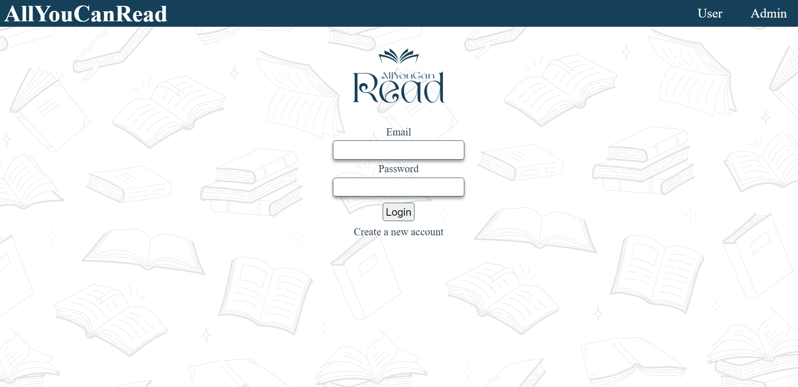
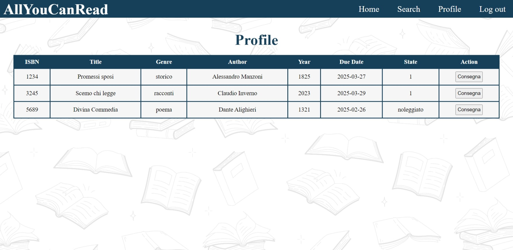
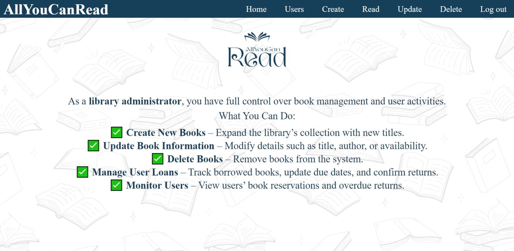

# AllYouCanRead

AllYouCanRead is an online platform for library management that allows customers to rent books in a simple and organized way.

AllYouCanRead enables librarians to manage the book catalog and customers to check and reserve available volumes. The software ensures smooth loan management, tracks availability, and provides an intuitive and responsive interface.

## Table of Contents

1. [Features](#features)
2. [Technologies and Libraries](#technologies-and-libraries)
3. [Installation](#installation)
4. [ALLYouCanRead Postman Documentation](#Allyoucanread-postman-documentation)
5. [Team Members](#team-members)

## Features

These features highlight the core functionalities of the app.

- 
- 
- 
- 
- 

### User Registration & Authentication

- Users can sign up and log in using a secure authentication system.
- JWT-based token authentication for secure API access.

### Management of the library by the administrator

- administrator can add, edit, and delete book/books to the library DB.

### Engagement of the library by the user

- user can search for the book/s, to reserve it online, user can visualize the summary of books on his account.

### Error Handling & Validation

- Error handling and validation for user actions, including invalid input and missing data.

## Technologies and Libraries

### Frontend

- HTML/CSS
- JavaScript
- Draw.io
- Canva
- Dependencies:
  - `dotenv`

### Backend

- Docker
- GoLang
- Dependencies:
  - `dotenv`
  - `encoding/json`
  - `github.com/gin-gonic/gin`
  - `gorm.io/gorm`
  - `time`

## Installation

1. Clone the repository:
   ```bash
   git clone https://gitlab.software-inside.it/c.occhipinti/allyoucanread.git
   ```
2. Navigate to the project directory:
   ```bash
   cd cmd
   ```
3. Install dependencies:
   ```bash
   go get github.com/joho/godotenv
   go get encoding/json
   go get github.com/gin-gonic/gin
   go get gorm.io/gorm
   ```
4. Start the development server:

   ```bash
   go run main.go
   ```

   The app will be available at [http://127.0.0.1:5500/web/html/index.html](http://127.0.0.1:5500/web/html/index.html).

## ALLYouCanRead Postman Documentation

[The API documentation is available on Postman for detailed interaction with the backend services](https://documenter.getpostman.com/view/29964184/2sAYdZuE3C)

## Team Members

Fork & Code team members:

- [Cazzato Agnese - Junior Developer](https://gitlab.software-inside.it/accademy_2025/agnese_progetto_giusto)
- [Inverno Claudio - Team Lead , Junior Developer](https://gitlab.software-inside.it/accademy_2025/claudio)
- [Maione Aniello - Junior Developer]()
- [Marino Diego - Junior Developer ](https://gitlab.software-inside.it/accademy_2025/DiegoProgetti)
- [Pustelnyk Nataliya - Junior Developer](https://gitlab.software-inside.it/accademy_2025/pustelnyk)
- [Zuozo Flavia - Junior Developer](https://gitlab.software-inside.it/accademy_2025/flavia-academy25)
